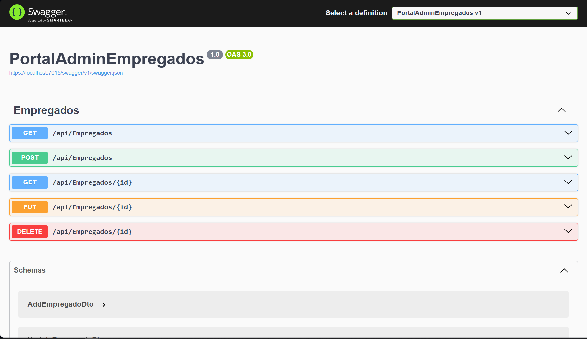

# PortalAdminEmpregados
Este projeto é uma API com estrutura simples com apenas uma Entidade e uma Tabela, podendo servir como base para APIs mais complexas.
Nesse caso específico a estrutura gira em torno de  um sistema de gestão de funcionários de determinada empresa.
É uma aplicação ASP.NET Core que utiliza o Entity Framework Core para acessar um banco de dados SQL Server.

> ### Palavras-Chave:
>  - C#
>  - AspNet Core
>  - Entity Framework Core
>  - SqlServer
>  - .NET 8

## Swagger

### As operações atuais incluem:
  - Retornar todos os fucionários da tabela
  - Buscar um funcionário específico pelo Id
  - Inserir
  - Editar
  - Deletar

### E os esquemas:
  - AddEmpregadoDto
  - UpdateEmpregadoDto

# Estrutura do Projeto
```plaintext
.
├── PortalAdminEmpregados
│   ├── Controllers
│   │   └── EmpregadosController.cs
│   ├── Data
│   │   ├── AppDbContext.cs
│   │   └── DesignTimeDbContextFactory.cs
│   ├── Migrations
│   ├── Models
│   │   ├── DTO
│   │   │   ├── AddEmpregadosDto.cs
│   │   │   └── UpdateEmpregadosDto.cs
│   │   └── Entidades
│   │       └── Empregado.cs
│   ├── Properties
│   │   └── launchSettings.json
│   ├── PortalAdminEmpregados.csproj
│   ├── PortalAdminEmpregados.http
│   ├── Program.cs
│   ├── appsettings.Development.json
│   └── appsettings.json
├── .gitattributes
├── .gitignore
├── LICENSE
├── PortalAdminEmpregados.sln
└── README.md
```

### Detalhes dos Arquivos e Pastas
- **PortalAdminEmpregados**: Diretório principal do projeto.
  - **Controllers**: Contém os controladores do projeto.
    - `EmpregadosController.cs`: Controlador responsável pelas operações relacionadas a empregados.
  - **Data**: Contém os arquivos de contexto e configuração do banco de dados.
    - `AppDbContext.cs`: Classe de contexto do banco de dados.
    - `DesignTimeDbContextFactory.cs`: Fábrica de contexto para uso em tempo de design.
  - **Migrations**: Contém as migrações do Entity Framework.
  - **Models**: Contém os modelos do projeto.
    - **DTO**: Contém os Data Transfer Objects.
      - `AddEmpregadosDto.cs`: DTO para adicionar empregados.
      - `UpdateEmpregadosDto.cs`: DTO para atualizar empregados.
    - **Entidades**: Contém as entidades do projeto.
      - `Empregado.cs`: Classe de entidade do empregado.
  - **Properties**: Contém arquivos de configuração do projeto.
    - `launchSettings.json`: Configurações de lançamento do projeto.
  - `PortalAdminEmpregados.csproj`: Arquivo de projeto do .NET.
  - `PortalAdminEmpregados.http`: Arquivo para testar as APIs.
  - `Program.cs`: Ponto de entrada do aplicativo.
  - `appsettings.Development.json`: Configurações de ambiente de desenvolvimento.
  - `appsettings.json`: Configurações do aplicativo.
- `.gitattributes`: Arquivo de atributos do Git.
- `.gitignore`: Arquivo de exclusões do Git.
- `LICENSE`: Licença do projeto.
- `PortalAdminEmpregados.sln`: Solução do projeto.
- `README.md`: Este arquivo.

## Instalação
1. Clone o Repositório
```
  git clone https://github.com/seu-usuario/PortalAdminEmpregados.git
```
2. Navegue até o diretório do projeto:
```
  cd PortalAdminEmpregados
```
3. Restaure as dependências do projeto:
```
  dotnet restore
```
4. Atualize o banco de dados para a última versão de migração:
```
  dotnet ef database update
```

## Uso
Para iniciar a aplicação, use o comando:
```
dotnet run
```

## Contribuição
1. Faça um fork do projeto.
2. Crie uma nova branch:
```
git checkout -b minha-nova-feature
```
3. Faça suas alterações e commit:
```
git commit -m 'Adiciona nova feature'
```
4. Envie para a branch original:
```
git push origin minha-nova-feature
```
5. Crie um pull request.

## Tecnologias utilizadas
- ASP.NET Core 6.6.2
- Entity Framework Core (SQL Server) 8.0.6
- Entity Framework Core Tools 8.0.6

## Licença
Este projeto está licenciado sob a Licença MIT - veja o arquivo [LICENSE](LICENSE) para mais detalhes.


